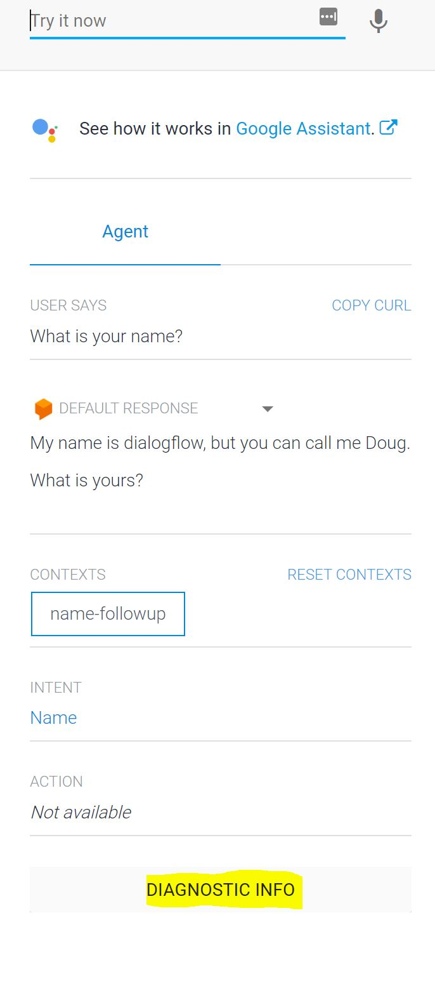
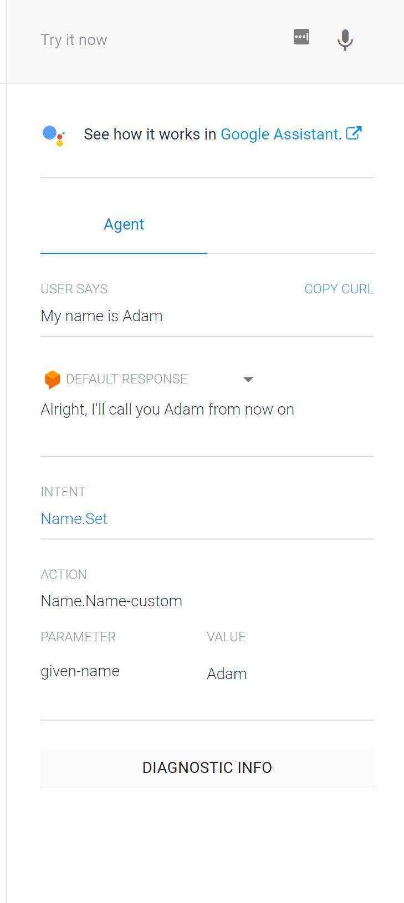

# Step 3. Follow-up questions

In [Step 2. Fulfillments](https://github.com/tibbing/jwy-dlgflow-demo/tree/steps/2.Fulfillments), you learned how to use a fulfillment to create responses dynamically.

In this step, you will learn how to handle **Contexts** to create follow-up questions and more complex dialog. 


----
## Ask for the bot's name

1. Navigate to **Intents** in the left menu
2. Create a new Intent, and call it **Name**
3. Add a few training phrases:
>"Who are you?"

>"What is your name?"

>"What should I call you??"

4. Toogle the switch next to **Enable webhook for this intent**
5. Click **Save** and wait for the *Agent training completed* message


6. Navigate to **Fulfillments** and update the code in the inline editor:


Paste the following code: ([Source code](/src/fulfillment-fn-node6.js))

```javascript
'use strict';

const functions = require('firebase-functions');
const {WebhookClient} = require('dialogflow-fulfillment');

process.env.DEBUG = 'dialogflow:debug'; // enables lib debugging statements

exports.dialogflowFirebaseFulfillment = functions.https.onRequest((request, response) => {
  const agent = new WebhookClient({ request, response });

  function welcome (agent) {
    agent.add(`Welcome to my agent!`);
  }

  function fallback (agent) {
    agent.add(`I didn't understand`);
    agent.add(`I'm sorry, can you try again?`);
  }

  function helloWorld (agent) {
    agent.add(`Hello World from Firebase!`);
  }

  function getBotName (agent) {
    agent.add(`My name is dialogflow, but you can call me Doug.`);
    agent.add(`What is yours?`);
  }

  function setName (agent) {
    agent.add(`Alright, nice to meet you`);
  }

  let intentMap = new Map();
  intentMap.set('Default Welcome Intent', welcome);
  intentMap.set('Default Fallback Intent', fallback);
  intentMap.set('HelloWorld', helloWorld);
  intentMap.set('Name', getBotName);
  intentMap.set('Name.Set', setName);
  agent.handleRequest(intentMap);
});
```

As you can see, we have added support for two new intents:
**Name** and **Name.Set**. 

Test it by typing one of the questions you trained your agent with in the test section to the right:

>"Who are you?"

The bot will tell his name, and then ask you about your name.




----
## Add a follow-up intent
It's time to add the follow-up intent.
1. In the Intents page, hover the **Name Intent** and click **Add follow-up intent**
2. Name your new intent **Name.Set**
3. You will notice that there is an input context called **Name-followup**.
3. Add a few training phrases:
>"John"

>"It's John"

>"You can call me John"

>"My name is John"

4. Note that Dialogflow automatically detects **John** as type **sys.given-name** and highlights them in the training phrases. It will also be added under **Action and parameters**

>**sys.given-name** is a built-in parameter type, and there are several other types like numbers, locations, colors, date/time etc. You can also add custom entities and populate them with your own range of values.

5. Toogle the switch next to **Enable webhook for this intent**
6. Click **Save** and wait for the *Agent training completed* message


----
## Testing

1. In the top right panel, type **"What is your name?"** and hit enter.
2. The bot will answer with it's name, and ask for yours. Type your name, and observe the response:



>If you were to say your name before asking for the bot's name, it would not understand what you meant. This is because an input context called **Name-followup** is required to trigger the Name.Set intent. 

>If you check the Name intent, you will see that it now has an output context with the same name, and an adjustable number which declares the context lifespan - how many consecutive queries before the context is invalidated. 

>For example: If the context lifespan is set to 3, you would reply to the bot's question "What is yours?" with something other than a name up to 3 times before the bot is no longer interested in your name.

----

In the next section, you will learn how to extract the provided name in the fulfillment, and remember it in future queries.
 
Now proceed to [Step 4. Parameters](https://github.com/tibbing/jwy-dlgflow-demo/tree/steps/4.Parameters)

