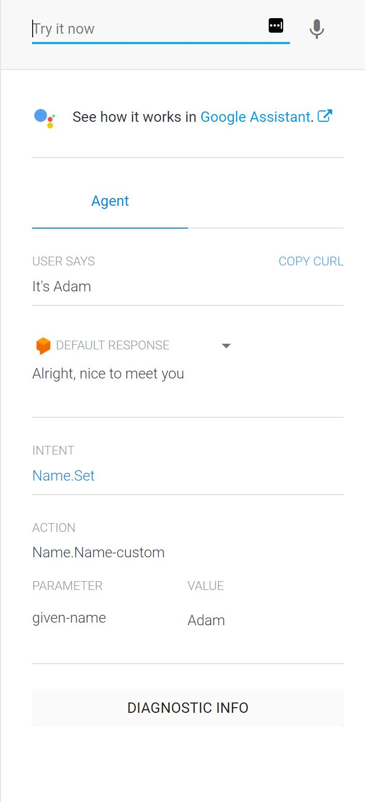

# Step 4. Parameters

In [Step 3. Follow-up questions](https://github.com/tibbing/jwy-dlgflow-demo/tree/steps/3.Fulfillments), you learned how to use **Contexts** to create follow-up questions. The bot asks for your name, which is handled as a *sys.given-name* type parameter. 

Now it's time to actually fetch this parameter in the fulfillment, and save it to use in further dialog.


----
## Update the fulfillment

1. Navigate to **Fulfillments** and update the code in the inline editor:

Paste the following code: ([Source code](/src/fulfillment-fn-node6.js))

```javascript
'use strict';

const functions = require('firebase-functions');
const {WebhookClient} = require('dialogflow-fulfillment');
let name = null;

process.env.DEBUG = 'dialogflow:debug'; // enables lib debugging statements

exports.dialogflowFirebaseFulfillment = functions.https.onRequest((request, response) => {
  const agent = new WebhookClient({ request, response });

  function welcome (agent) {
    agent.add(`Welcome to my agent!`);
  }

  function fallback (agent) {
    agent.add(`I didn't understand`);
    agent.add(`I'm sorry, can you try again?`);
  }

  function helloWorld (agent) {
    agent.add(`Hello World from Firebase!`);
  }

  function getBotName (agent) {
    agent.add(`My name is dialogflow, but you can call me Doug.`);
    agent.add(`What is yours?`);
  }

  function setName (agent) {
    name = agent.parameters["given-name"];
    agent.add(`Alright, I'll call you ${name} from now on`);
  }

  function getName (agent) {
    if(name === null){
        agent.add(`I don't know. What do you want me to call you?`);
    }else{
        agent.add(`Your name is ${name}`);
    }
  }

  let intentMap = new Map();
  intentMap.set('Default Welcome Intent', welcome);
  intentMap.set('Default Fallback Intent', fallback);
  intentMap.set('HelloWorld', helloWorld);
  intentMap.set('Name', getBotName);
  intentMap.set('Name.Set', setName);
  intentMap.set('Name.Get', getName);
  agent.handleRequest(intentMap);
});
```

The *setName()* method now extracts the parameter **given-name** and stores it into a global variable **"name"**. Since this is a stateless cloud function, there is no guarantee that global variables are actually retained in between requests - but usually it lives for a while. 

We have also added a new handler for intent **Name.Get**, that either replies with the stored name, or asks for it if it's empty.


Now, let's add a new intent called **Name.Get**:

1. In the Contexts section, add an output context called **Name-followup**. This is required for the bot to trigger the **Name.Set** intent if the name is not already stored, and it asks for your name. 

2. Add a training phrase:
>"What is my name?"
3. Toogle the switch next to **Enable webhook for this intent**
4. Click **Save** and wait for the *Agent training completed* message


----
## Testing

1. In the top right panel, type **"What is your name?"** and hit enter.
2. The bot will answer with it's name, and ask for yours. Type your name, and observe the response:




3. Now, type **"What is my name?"** and hit enter.
The bot should reply with your name.


----

