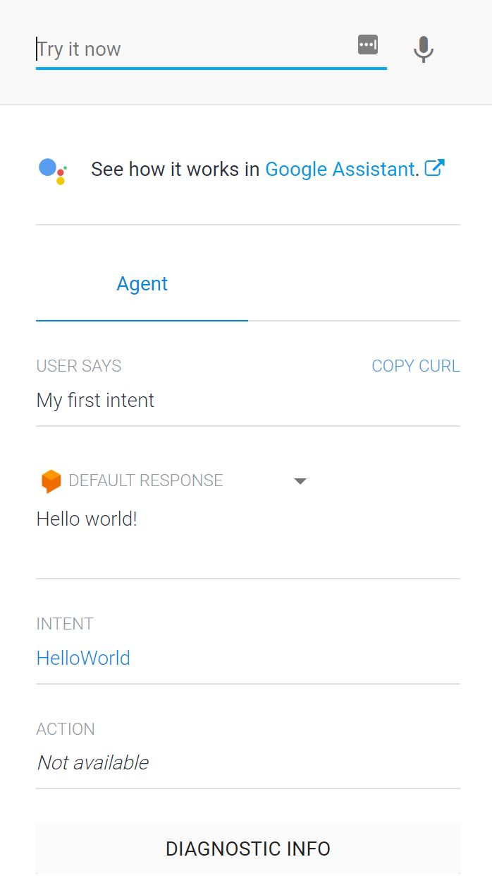

# Step 1. Hello World

----
## Dialogflow Setup
Navigate to [dialogflow.com](https://dialogflow.com)

> Dialogflow requires a Google account for log in. This guide will assume that you have already created one that you will be using.

1. Click the Sign in with Google button
2. Allow Dialogflow to access your google Account
3. Accept Dialogflow's terms of service

----
## Creating your first agent

1. Click **Create agent** in the left menu
2. Select a name for your agent.
3. Make sure that the default language is set to **English - en**
4. Leave the rest of the settings at their default values, and click **Create**

----
## Create an intent

* Click **Intents** in the left menu
* You will see that there are already two default intents created - Welcome and Fallback. 
* Click **Create intent**

1. Name the new Intent **"HelloWorld"**
2. Expand the **Training phrases** section, and type **"My first intent"**
3. Expand the **Responses** section, and type **"Hello world!"**

----

## Testing

1. In the top right panel, type **"My first intent"** and hit enter.
2. The default response should be **"Hello world!"**

----

That's it! You have successfully created your first agent and hello world intent! 
Now proceed to [Step 2. Fulfillments](https://github.com/tibbing/jwy-dlgflow-demo/tree/steps/2.Fulfillments)

